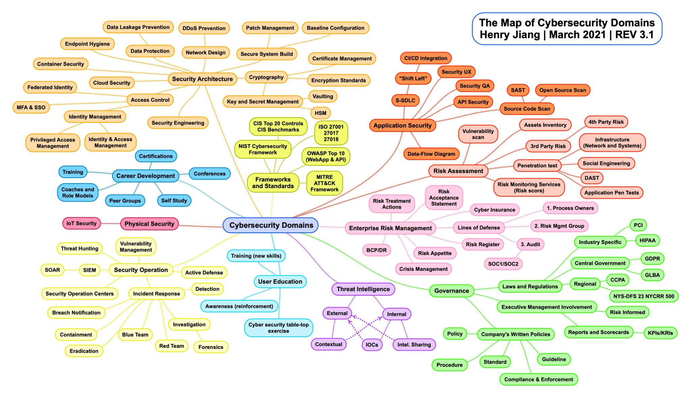

## Cyber Security Domains

### Application Security
- S-SDLC
- `Shift Left`
- CI/CD (Continuous Integration/Continuous Development) Pipeline or Integration
- Security UX (User Experience)
- Security QA (Quality Assurance)
- API (Application Programming Interface) Security
- Source Code Scan
- Open Source Scan
- SAST (Static Application Security Testing)

### Below is an image: Map of Cybersecurity Domains created by `Henry Jiang on March 2021 | REV3.1`

### Qualities I have learned are beneficial in this domain:
- Do the Free stuff first
- Curious mindset / Growth mindset
- Soft skills
- Communication skills
- Technical writing 
- Java programming language 
- Python programming
- Bash / Powershell  
- Linux, MacOSX, Windows OS
- Computer Networking

### What is not on my LinkedIn profile: How have I grown from my failures (Opportunities for improvement)?
- Don't fake it til you make it! Be confident in what you know, be honest about what you don't know, and don't be afraid to ask for assistance. 
- Falling down happens and not everyone picks themselves back up. I have fallen so many times that I have learned to say thank you for that fall, I dust myself off, find out why I fell, and how to prevent that for the next time.
- Take the opportunity or make the opportunity
- I have learned that fear can stop me dead in my tracks. I have learned to listen to that fear and then ask myself what will it look like if I can't do this? Then keep trying. 
- Manage your stress and grow from new experiences until I can't physically can't learn anymore. Mental health is real and alert fatigue is real, address your physical and mental health. 
- Pay it forward 

### Follow my AppSec learning journey:
- Go to [My transition to AppSec page](https://github.com/yettsyjk/TransitioningToCyberSecurity_ApplicationSecurity/blob/main/README.md)
- Go to [My DAST training resources](https://github.com/yettsyjk/TransitioningToCyberSecurity_ApplicationSecurity/blob/main/DAST_resource.md)
- Go to my journey with [Web App Injection Types resources](https://github.com/yettsyjk/TransitioningToCyberSecurity_ApplicationSecurity/blob/main/WebAppInjectionTypes.md)
- Go to my journey with [Cyber Security Domains](https://github.com/yettsyjk/TransitioningToCyberSecurity_ApplicationSecurity/edit/main/AppSec_Resources.md) 
- thanks!
